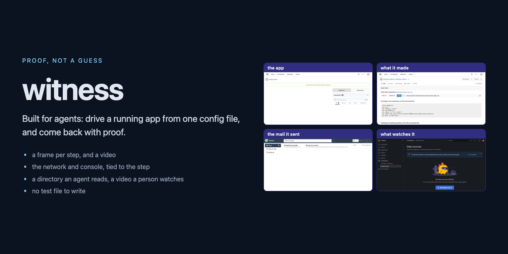
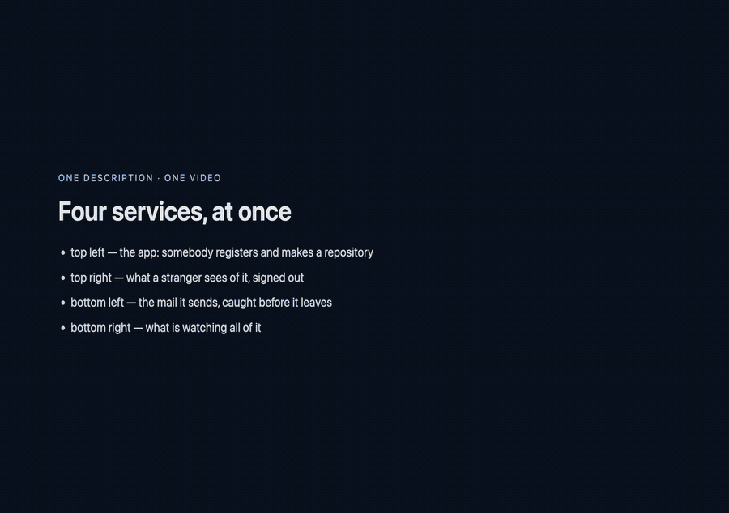

# witness _(@burrows99/witness)_



[](https://github.com/RichardLitt/standard-readme)
[](https://github.com/burrows99/witness/releases)
[](https://nodejs.org)
[](https://github.com/burrows99/witness/actions/workflows/tests.yml)
[](LICENSE)

Built for AI agents: drive and debug a running app from one config file, and come back with proof —
watchable by a person, readable by an agent. Not a pass/fail, and not a guess.

[Who is driving](#who-is-driving) · [Install](#install) · [Describe a product](#describe-a-product) ·
[Write an action](#write-an-action) · [Run it](#run-it) ·
[What a run leaves behind](#what-a-run-leaves-behind) · [Example](#example-four-services) ·
[When not to use this](#when-not-to-use-this)

Describe your product in `.witness/config.jsonc` — where the services are, what the API can be asked,
what a person sees, what they can do — and drive it against the real thing: the containers on this
machine, the database behind them, the browser in front of them. What comes back is the requests with
their bodies, a frame per step, a video, and a note a person can follow to check it themselves.

**There is no test file to write.** An action composes other actions, narrates, and asserts against the
screen, the API and the database. It exists because an agent or a person changes some code and then
needs to *see it work* — and the alternative is throwaway curl, ad-hoc psql, a screenshot taken by hand,
and nothing anyone can rerun.

## Table of Contents

- [Who is driving](#who-is-driving)
- [Install](#install)
- [Describe a product](#describe-a-product)
- [Write an action](#write-an-action)
- [Run it](#run-it)
- [What a run leaves behind](#what-a-run-leaves-behind)
- [Example: four services](#example-four-services)
- [Keeping a description true](#keeping-a-description-true)
- [When not to use this](#when-not-to-use-this)
- [API](#api)
- [Maintainers](#maintainers)
- [Contributing](#contributing)
- [License](#license)

## Who is driving

**Mostly an agent.** Something changes code and then has to answer *does it work* — and an agent
cannot open a network tab, watch a screen, or scrub a video. What it can do is read a filesystem. So
what it does instead is infer: the build passed, the handler looks right, the field is probably
rendering. That inference is cheap, confident, and wrong often enough to matter — and from the
outside it is indistinguishable from having actually looked.

This closes that gap by making the looking mechanical. Every command prints the whole exchange, and
every run writes a directory whose shape is the call tree: the requests with their bodies, a frame
per step, the console and network tied to the step that was running, and a note in English. **One
artefact, two readers** — an agent gets there by listing a directory, a person by opening the video
beside it, and both are checking the same claim rather than trading assurances about it.

## Install

Published to **GitHub Packages**. Point your project at it once, in `.npmrc`:

```
@burrows99:registry=https://npm.pkg.github.com
```

```bash
npm install --save-dev @burrows99/witness
npx witness init                          # writes .witness/{config.jsonc, SKILL.md, .gitignore}
```

GitHub Packages [asks for a token even when the package is public](https://docs.github.com/en/packages/learn-github-packages/about-permissions-for-github-packages)
— any token with `read:packages`, and in CI `${{ secrets.GITHUB_TOKEN }}` already has it. Installing
from git needs no token: `npm i -D github:burrows99/witness`.

**Needs** Node 22.6+. Optionally Docker (to read a container's environment or its database),
[Playwright](https://playwright.dev) as a peer dependency (for the browser half), and ffmpeg (for MP4s).

## Describe a product

Everything lives under one directory, found the way git finds a repository — walk up, nearest wins.
`--config <file>`, `WITNESS_CONFIG` and `WITNESS_DIR` override it in that order; `witness config where`
says which is in force.

```
your-project/
  .env                  the ports and container names compose reads
  docker-compose.yml
  .witness/
    config.jsonc        the description
    SKILL.md            how to use this, generated — `witness skill` rewrites it
    artifacts/          what runs leave behind
```

A **service** carries everything true about it. The top level carries only what is shared:

```jsonc
{
  "name": "acme",
  "services": {
    "web": {
      "kind": "in-house", "port": 3000, "portVar": "WEB_PORT", "container": "acme-web",

      // Inside a service, `containerEnv` means THAT service's container.
      "secrets": { "adminKey": { "containerEnv": "ADMIN_KEY" } },

      // The first service with an `api` is what `witness api …` talks to; a second becomes a client.
      "api": {
        "auth": { "service": { "provider": "apiKey", "header": "x-api-key", "from": { "secret": "adminKey" } } },
        "operations": { "orders.show": { "path": "/v1/orders/{orderId}", "auth": "service" } }
      },

      "app": { "routes": { "order": "/orders/{orderId}" } },
      "actions": { "cancelOrder": { "…": "below" } }
    },

    "postgres": {
      "kind": "in-house", "port": 5432, "container": "acme-postgres", "probe": "container",
      "database": {
        "user": "acme", "database": "acme",
        "credential": { "containerEnv": "POSTGRES_PASSWORD" },
        "queries": { "order.status": "select status from orders where id = '{orderId}'" }
      }
    }
  },
  "cast": { "REGULAR": { "id": "…", "why": "the only account with a saved card" } },
  "cli": { "order": { "verbs": { "show": { "operation": "orders.show", "args": ["orderId"] } } } }
}
```

`witness config template` prints every field this version understands, generated from the type
declarations — so it describes the version you have.

## Write an action

The sequence, its narration and its claims, all data:

```jsonc
"customer.refundAnOrder": {
  "summary": "cancel an order and check the refund really landed",
  "inputs": ["orderId"],
  "steps": [
    { "slide": { "title": "Refunding an order", "kicker": "before", "lines": ["What the customer sees, and what the API says."] } },
    { "run": { "action": "signIn", "with": { "email": "{email}" } } },
    { "goto": { "route": "order", "params": { "orderId": "{orderId}" } } },
    { "click": { "role": "button", "name": "Cancel order" } },
    { "expect": { "on": { "text": "Refund on its way" }, "because": "the customer is told, not just the ledger" } },
    { "frame": "the order, cancelled" },

    { "api": { "operation": "orders.show", "params": { "orderId": "{orderId}" }, "as": "order" } },
    { "check": { "that": "{order.status}", "equals": "REFUNDED", "because": "the screen and the API must agree" } },
    { "query": { "name": "order.status", "as": "stored" } },
    { "check": { "that": "{stored}", "contains": "REFUNDED", "because": "and so must what was written down" } }
  ]
}
```

- `run` composes small actions into big ones, and a service's action reaches its siblings by bare name.
- `expect` is about the screen; `check` is about the values a run has gathered. Together they make a
  cross-layer claim without a program.
- `{secret.name}` reaches a declared credential — resolved when asked for, never stored, and redacted
  out of recorded request bodies.
- `{waitForUrl: {route}}` resolves through the declared port instead of hardcoding a host.

A third party's client and a stub server stay as code, attached with `use()`. The system is importable
when a project needs it (`System.find()`, `app.run`, `app.api.call`); nothing here requires that.

## Run it

```bash
npx witness stack status                              # what is up, on which ports
npx witness api get /v1/health                        # any route, authenticated as the config says
npx witness db sql "select 1"                         # the stack's database
npx witness order show 1234                           # the verbs the config declares
npx witness action list                               # what the product can DO
npx witness action run app.signIn email=ada@example.com
npx witness action run checkout refund --parallel     # side by side, in one video
npx witness action run flaky --retries=2              # a fresh browser each go
npx witness check drift app.signIn                    # does the description still match what runs
EVIDENCE=before npx witness action run app.checkout   # record a "before" cut
```

Every command reports the whole exchange — request, response, statement, timing — because the caller is
usually an agent that cannot open a network tab. `--quiet` for the bare answer. Exit codes: `0` worked,
`1` ran and failed, `2` no such thing.

## What a run leaves behind

One directory, named for what was run. **The directory tree is the call tree**: an action a step
composed sits inside that step, named for it.

```
.witness/artifacts/cli/<what you ran>/<cut>/
  README.md                       what is where, and the call tree
  video.mp4                       one browser session, one video
  frames/01-her-dashboard.png     the stills a `frame` step named
  manual-verification.md          what the action's `verify` said, filled with what this run saw
  refundAnOrder/
    01-slide.png … 12-check.png   a frame per step
    debug.md                      what happened, network and console tied to each step
    02-signIn/                    ← the action step 2 ran
      01-goto.png … 05-expect.png
      debug.md
```

`<cut>` is `before`, `after` or `run`, so two halves of a comparison sit side by side. `slide` steps are
spliced in as full-frame cards; `--parallel` stitches lanes into panels of one frame.

### The debug story

```md
# customer.cancelOrder — failed at step 3 of 5 (8.4s)

## What it was doing
1. ✓ `goto` /orders/1 — 412ms · refundAnOrder/01-goto.png
2. ✓ `click` role=button name=Cancel — 180ms · …
3. ✗ `expect` text=Cancelled — 30.0s · …

## Where it broke
**During that step:** 3 requests, **1 of them failed** · the console said 1 thing worth reading
**POST /api/orders/1/cancel** → 500 (412ms) during `click Cancel`
  Sent:       {"reason":null}
  Came back:  {"message":"reason is required"}
> `error` Cannot read properties of undefined (reading 'id') — app.js:12
```

Every request, log and exception is tagged with the step running when it happened. That join is what a
person does by hand across three panes and an agent reading a filesystem cannot do at all. It is
recorded through Playwright's own page events; the story names Playwright's trace rather than replacing
it.

## Example: four services

This repository is the example — `docker-compose.yml` and `.witness/config.jsonc` at the root. Four
services, because a typical stack is not one: an app people use, the database it writes to, the mail it
sends, and something watching all of it.

```bash
docker compose up -d
npx witness action run theApp theOutsider theMail theWatcher --parallel
```



Four browsers, four panes, one video. The top-left registers an account, makes a repository and asks for
a password reset; the others react — the repository appears to a signed-out stranger, the mail lands in
the catcher. Nothing coordinates them.

```bash
npx witness action run tour     # the same ground sequentially, checked against every layer
```

The sequential tour checks each screen against the layer underneath it:

```jsonc
{ "query": { "name": "accounts", "as": "accounts" } },
{ "check": { "that": "{accounts}", "contains": "1", "because": "the account the screen made should be a row" } },
{ "api": { "client": "mailpit", "operation": "messages", "as": "mail" } },
{ "check": { "that": "{mail.messages_count}", "atLeast": 1, "because": "the app sends a message, and this is where it lands" } }
```

One run's output is in [`docs/example/`](docs/example): the [story](docs/example/debug.md), the
[note](docs/example/manual-verification.md), and the [layout](docs/example/artifacts-README.md) it wrote
to explain itself. The tour expects a fresh stack — `docker compose down -v && docker compose up -d`.

## Keeping a description true

A description is built by whoever is shipping, **one change at a time**: if your change touches a
screen, the same change describes it.

**A locator you have not run is a guess.** Of the nine actions first written against Grafana here, five
named something that did not exist — a button styled as a link, a placeholder with different words, a
test id with the item's name appended. None of it was visible in the source; all of it was in the frame
from the step that failed.

```bash
npx playwright codegen <url>        # locators, chosen the way this resolves them
npx witness action run yours        # it will fail on one; open the frame the story names
npx witness check drift app.signIn  # every claim the description makes, re-checked at once
```

`check drift` visits each declared route and counts each locator the step using it depends on. On the
example's own description run against an older Grafana it reports three breakages in 7 seconds and exits
non-zero; a single run reports one, in 47.

Also worth keeping:

- **Drive the real app.** A row written by hand is a row the app never agreed to.
- **Assert at the right layer.** The screen for what rendered, the API for what it answered, the
  database for what was stored.
- **Read the running container, not the file it was built from.**
- **Say why.** `because` on a claim becomes the failure message, which is the only sentence anyone reads.

## When not to use this

- **You want a test suite.** `playwright test` gives you `--workers`, `--shard`, `--retries`,
  `--project`, HTML reports and `merge-reports`. This drives a product and writes down what happened; it
  is not a second Playwright. The system is importable, so a project can run actions inside
  `playwright test` and have both.
- **You want unit tests.** Nothing here is faster than a function call.
- **Your product has no running instance.** Everything is driven against a real thing.
- **You want locators generated.** `playwright codegen` already does that, better.

## API

`System.find()` assembles everything from the description: `Stack` (where the services are, from the
same `.env` compose reads), `Docker`, `HttpApi`/`Operations`, `Postgres`/`Queries`, `WebApp`/`Screen`,
`Actions`, `SignIn`, `Evidence`, `Inspector`, `Story`, `Skill`, `StubServer` and `Cli`. Each stands
alone — use `Stack` by itself to find a local service, or all of it to drive a flow and get a video.

Everything meeting the outside world is a provider the config picks **by name**, so a second way of
doing any of them is a registration rather than an edit.

| Kind | Registered today | Where |
|---|---|---|
| client | `rest`, `graphql` | `src/providers/clients.ts` |
| auth | `apiKey`, `bearer`, `basic`, `cookie`, `login` | `src/providers/auth.ts` |
| secret | `containerEnv`, `secret`, `envFile`, `env`, `literal` | `src/providers/secrets.ts` |
| recorder | `terminal` (VHS) | `src/providers/recorders.ts` — captures a service *while it runs* |
| video | `ffmpeg` | `src/providers/video.ts` — turns what was captured into one watchable file |
| stub | `http` | `src/providers/stubs.ts` |

## Maintainers

[@burrows99](https://github.com/burrows99)

## Contributing

Issues and pull requests welcome: [open an issue](https://github.com/burrows99/witness/issues) for a
question, a bug, or something that surprised you.

```bash
npm install
npm run check     # types (tests included), lint, dead code, then the suite
```

| | |
|---|---|
| `npm run typecheck` | `tsc`, over the tests too — they do not ship, which is not a reason not to check them |
| `npm run lint` | type-aware ESLint: a floating promise here is a step that silently did not happen |
| `npm run deadcode` | knip — files and exports nothing reaches |
| `npm test` | `node --test`, no framework and nothing to configure |
| `npm run package` | publint, over what `npm pack` would actually publish |

CodeQL runs on every change and weekly.

What the codebase asks of a change:

- **A test beside the file it tests** (`src/thing.ts` → `src/thing.test.ts`), driving the real thing with
  the outside world handed in rather than mocking the module next door.
- **Explicit `.ts` extensions on every import** — the same files load under Node, under a test runner and
  from a package.
- **A comment that says why, not what.**
- No new runtime dependencies. Playwright is an optional peer.

## License

MIT © 2026 burrows99

See [LICENSE](LICENSE).
