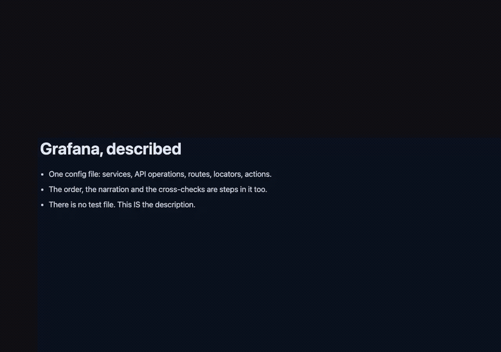

# witness _(@burrows99/witness)_

[](https://github.com/RichardLitt/standard-readme)
[](https://github.com/burrows99/witness/releases)
[](https://nodejs.org)
[](https://github.com/burrows99/witness/actions/workflows/tests.yml)
[](LICENSE)

Drive a running system from one config file, and come back with evidence rather than a pass/fail.

Describe your product once in `.witness/config.jsonc` — where the services are, what the API can be
asked, what a person sees, what they can do — and drive it against the real thing: the containers on
this machine, the database behind them, the browser in front of them. What comes back is the requests
with their bodies, a frame per step, a video, and a note a person can follow to check it themselves.

**There is no test file to write.** An action composes other actions, narrates, asserts against the
screen and against what the API answered or the database stored — all of it data. It exists because an
agent (or a person) changes some code and then needs to *see it work*, and the alternative is throwaway
curl, ad-hoc psql, a screenshot taken by hand, and nothing anyone can rerun.

The package is `@burrows99/witness` because a GitHub Packages name is always scoped to the account that
owns the repository, and the unscoped name is taken on npmjs.com.

## Table of Contents

- [Install](#install)
- [Usage](#usage)
- [Evidence](#evidence)
- [A worked example: Grafana, from nothing](#a-worked-example-grafana-from-nothing)
- [Where a description comes from](#where-a-description-comes-from)
- [The conventions worth keeping](#the-conventions-worth-keeping)
- [API](#api)
- [Maintainers](#maintainers)
- [Contributing](#contributing)
- [License](#license)

## Install

Published to **GitHub Packages**. Point your project at it once, in `.npmrc` beside your `package.json`:

```
@burrows99:registry=https://npm.pkg.github.com
```

```bash
npm install --save-dev @burrows99/witness
npx witness init                          # writes .witness/{config.jsonc, SKILL.md, .gitignore}
```

GitHub Packages [asks for a token even when the package is public](https://docs.github.com/en/packages/learn-github-packages/about-permissions-for-github-packages)
— any token with `read:packages` (`npm config set //npm.pkg.github.com/:_authToken $TOKEN`), and in CI
`${{ secrets.GITHUB_TOKEN }}` already has it. Installing from git needs no token:
`npm i -D github:burrows99/witness`.

**Needs** Node 22.6+. Optionally: Docker (to read a container's environment or its database),
[Playwright](https://playwright.dev) as a peer dependency (for the browser half), ffmpeg (for MP4s).

## Usage

```
your-project/
  .env                  the ports and container names compose reads
  docker-compose.yml
  .witness/
    config.jsonc        the description of this product
    SKILL.md            how to use this, generated — `witness skill` rewrites it
    artifacts/          what runs leave behind — ignored by the .gitignore beside it
```

Everything witness reads and writes is under that one directory, found the way git finds a repository:
walk up from the working directory, nearest wins. `--config <file>`, `WITNESS_CONFIG` and `WITNESS_DIR`
override it in that order; `witness config where` says which is in force and why.

### The description

`witness init` writes one generated from the types, with every field documented. Cut down to what one
product uses:

```jsonc
{
  "name": "acme",

  // A service carries everything true about it. Nothing inside names the service again — being
  // written here is what says which one it is about.
  "services": {
    "web": {
      // Where it runs. Ports and container names come from the same `.env` compose reads, so a
      // second checkout needs no wrapper script. `kind` says whose software it is: a third party is
      // not restartable, not resettable, and the likeliest source of a flake that is nobody's fault.
      "kind": "in-house", "port": 3000, "portVar": "WEB_PORT", "container": "acme-web",

      // Its credentials. Its own actions reach them as `{secret.adminKey}`; anything else says
      // `{secret.web.adminKey}`. Two services may each have one of the same name.
      "secrets": { "adminKey": { "containerEnv": { "service": "web", "key": "ADMIN_KEY" } } },

      // What it can be asked. The one service with an `api` is what `witness api …` talks to;
      // a second service's becomes a named client.
      "api": {
        "auth": { "service": { "provider": "apiKey", "header": "x-api-key", "from": { "env": "ADMIN_KEY" } } },
        "operations": { "orders.show": { "path": "/v1/orders/{orderId}", "auth": "service" } }
      },

      // What a person sees of it: routes become screens, and one sign-in flow serves every action.
      "app": { "routes": { "order": "/orders/{orderId}" }, "locators": { "cancel": { "role": "button", "name": "Cancel order" } } },

      // What can be DONE with it. No prefix and no `app`: `witness action run web.cancelOrder`
      // finds this, and one of its own steps reaches a sibling by bare name.
      "actions": {
        "cancelOrder": {
          "inputs": ["orderId"],
          "steps": [
            { "goto": { "route": "order", "params": { "orderId": "{orderId}" } } },
            { "click": { "role": "button", "name": "Cancel order" } },
            { "expect": { "on": { "text": "Cancelled" }, "because": "the order should show as cancelled" } }
          ]
        }
      }
    },

    "postgres": {
      "kind": "in-house", "port": 5432, "container": "acme-postgres", "probe": "container",
      // `credential` is a secret source like any other — read out of the running container rather
      // than written here, which is the habit worth keeping even where the value is a local one.
      "database": { "user": "acme", "database": "acme",
                    "credential": { "containerEnv": { "service": "postgres", "key": "POSTGRES_PASSWORD" } },
                    "queries": { "order.status": "select status from orders where id = '{orderId}'" } }
    }
  },

  // Only what is SHARED, or about more than one service.
  "secrets": { "ciToken": { "env": "CI_TOKEN" } },
  "cast": { "REGULAR": { "id": "…", "why": "the only account with a saved card" } },
  "cli": { "order": { "verbs": { "show": { "operation": "orders.show", "args": ["orderId"] } } } }
}
```

An action about more than one service goes in a top-level `actions`, where it names them:
`{ "run": "web.signIn" }`. Everything else about one service lives under it, written once.

### Writing an action

The sequence, its narration and its claims — all of it data:

```jsonc
"customer.refundAnOrder": {
  "summary": "cancel an order and check the refund really landed",
  "app": "customer",
  "inputs": ["orderId"],
  "steps": [
    { "slide": { "title": "Refunding an order", "lines": ["What the customer sees, and what the API says."] } },
    { "run": { "action": "customer.signIn", "with": { "email": "{email}" } } },
    { "goto": { "route": "order", "params": { "orderId": "{orderId}" } } },
    { "click": { "role": "button", "name": "Cancel order" } },
    { "expect": { "on": { "text": "Refund on its way" }, "because": "the customer is told, not just the ledger" } },
    { "frame": "the order, cancelled" },

    { "api": { "operation": "orders.show", "params": { "orderId": "{orderId}" }, "as": "order" } },
    { "check": { "that": "{order.status}", "equals": "REFUNDED", "because": "the screen and the API must agree" } },
    { "query": { "name": "order.status", "as": "stored" } },
    { "check": { "that": "{stored}", "contains": "REFUNDED", "because": "and so must what was written down" } }
  ]
}
```

`run` composes small actions into big ones without making either less usable alone. `expect` is about
the screen and `check` is about the values, which is what makes a cross-layer claim expressible without
a program. A credential reaches a step as `{secret.<name>}` — resolved when asked for, never typed on a
command line and never kept as a stored value; recorded request bodies have their `password`, `token`
and `authorization` fields redacted, because a debug story is a file people paste into pull requests.

**The dividing line that keeps this honest: a route, a request, a query or a click is data; a program is
a program.** A third party's client and a stub server stay as code, attached with `use()`. The system is
importable when a project genuinely needs code (`System.find()`, `app.run`, `app.api.call`); nothing
here requires it.

### CLI

The config above gives you all of this, with no entry point to write:

```bash
npx witness config template            # every field this version understands, documented
npx witness stack status               # what is up, on which ports, from which checkout
npx witness api get /v1/health         # any route, authenticated the way the config says
npx witness db sql "select 1"          # the stack's database
npx witness order show 1234            # the verbs the config declares
npx witness check drift app.signIn     # does the description still match what is running
npx witness action list                # what the product can DO
npx witness action run app.signIn email=ada@example.com
EVIDENCE=before npx witness action run app.checkout   # record a "before" cut
```

Every command reports the whole exchange — request, response, statement, timing — because the caller is
usually an agent that cannot open a network tab. `--quiet` for the bare answer. Exit codes: `0` worked,
`1` ran and failed, `2` no such thing.

## Evidence

Everything about one run lands in one directory, named for what was run rather than by hand:

```
.witness/artifacts/cli/<the actions you ran>/<cut>/
  README.md                       what is where, and the call tree
  video.mp4                       the recording — one browser session, one video
  frames/01-her-dashboard.png     the stills a `frame` step named, in order
  manual-verification.md          what the action's `verify` said, filled with what this run saw
  refundAnOrder/                  ← a directory per action
    01-slide.png … 12-check.png   a frame per step, numbered as they happened
    debug.md                      what happened, with the network and console tied to each step
    02-signIn/                    ← an action a step COMPOSED sits inside that step
      01-goto.png … 05-expect.png
      debug.md
```

**The directory tree is the call tree.** Playwright files its own artefacts in one flat, opaquely
named directory and puts the structure in the trace viewer — right when a person is reading, useless
when a program is. The cost of inverting that is that the layout has to explain itself, which is what
the `README.md` and the numbered directory names are for: `02-signIn` is the action step 2 ran.

`<cut>` is `before`, `after` or `run`, so the two halves of a before/after sit side by side instead of
overwriting each other. `slide` steps are spliced into the video as full-frame cards, so it opens on
what it means to show.

### The debug story

```md
# customer.cancelOrder — failed at step 3 of 5 (8.4s)

## What it was doing
1. ✓ `goto` /orders/1 — 412ms · actions/customer.cancelOrder/01-goto.png
2. ✓ `click` role=button name=Cancel — 180ms · …
3. ✗ `expect` text=Cancelled — 30.0s · …

## Where it broke
**During that step:** 3 requests, **1 of them failed** · the console said 1 thing worth reading
**POST /api/orders/1/cancel** → 500 (412ms) during `click Cancel`
  Sent:       {"reason":null}
  Came back:  {"message":"reason is required"}
> `error` Cannot read properties of undefined (reading 'id') — app.js:12
```

The point is the **correlation**: every request, log and exception is tagged with the step running when
it happened. "A 500 came back" is not a diagnosis; "the 500 came back during `click Cancel`, and the
console error a tick later says the reducer got undefined" is one — the join a person does by hand
across three panes, which an agent reading a filesystem cannot do at all.

This does not reimplement the tools: it is recorded through Playwright's own page events and written
down beside the run. The story is what a *program* reads; Playwright's trace is what a *person* opens,
and the story names it rather than replacing it.

## A worked example: Grafana, from nothing

Real and reproducible — [`examples/grafana/`](examples/grafana). Grafana is somebody else's software,
chosen because neither this tool nor its author has any say over it.

```bash
cd examples/grafana && docker compose up -d
npx witness action run grafana.theWholeProduct
```

No arguments and no environment variables: the credentials are declared as `containerEnv` and read back
out of the running container, which is where a real one would come from too.



*(the [MP4](docs/example/grafana.mp4) is what the run produced; the GIF is it, for GitHub)*

One action produced that — no test file, no page objects, no code. It composes seven smaller ones, each
still runnable alone, and checks Grafana against its own API as it goes:

```jsonc
{ "run": "grafana.openDashboards" },
{ "frame": "dashboards, empty" },
{ "api": { "operation": "search", "as": "listed" } },
{ "check": { "that": "{listed.length}", "equals": "{stats.dashboards}",
             "because": "the API and the screen should agree about how many dashboards there are" } }
```

The whole of it is [`config.jsonc`](examples/grafana/.witness/config.jsonc), and one run's output is in
[`docs/example/`](docs/example): the [story](docs/example/debug.md) and the
[note](docs/example/manual-verification.md), both generated.

The same description answers questions without a browser at all:

```bash
$ npx witness instance health --quiet
{ "database": "ok", "version": "13.2.0", "commit": "f681b1359f6a0b8ecb9f2c49a88ac72b75bde73b" }
```

## Where a description comes from

Driving a product is the solved half. Describing one is a practice: a description is built by whoever is
shipping, **one change at a time**. If your change touches a screen, the same change describes it. A
description written that way is never out of date, because it was never written separately from the
thing it describes.

The judgment half is which flows matter and what to claim. The half that needs no judgment is what a
screen actually renders — and that is not read out of the app's source:

```bash
witness action run yours                   # it will fail on a locator; that is the point
#   … open the frame the story names, fix it, run again …
```

When a run that used to pass breaks, `witness check drift <the action that signs in>` re-checks every
claim the description makes — each locator against the route the step using it is on — and names all of
them at once. Measured on the example: a description written for Grafana 13.2, run against 10.4, breaks
in three places. The run reports one, after 47 seconds. The check reports all three in 7, exits non-zero
so a pipeline can gate on it, and says nothing at all when the description is right.

Do not hand-write a locator you could be handed, either. **`npx playwright codegen <url>`** records what
you do and prints a locator per step, chosen [the same way this tool resolves
them](https://playwright.dev/docs/codegen) — *"prioritizing role, text and test id locators"*, improving
the locator when more than one element matches. **Pick Locator** gives you one for anything you hover,
and `--save-storage` / `--load-storage` lets you record the screen behind a login rather than the login.
Witness does not reimplement any of that, and should not.

**A locator you have not run is a guess.** In the Grafana example, five of nine actions named something
that did not exist — `Skip` was a `button` styled as a link, a placeholder read "Search Grafana plugins"
and not "Search all", a card's test id had the plugin's name appended, and a table's header is a `row`
like any other. None of it was visible in Grafana's source. All of it was in the frame from the step
that failed.

## The conventions worth keeping

Not the tool's rules — what makes the output worth anything.

- **Drive the real app.** A row written by hand is a row the app never agreed to, and a test built on
  one passes for the wrong reason.
- **Assert at the right layer.** The screen is evidence of what rendered, the API of what it answered,
  the database of what was stored. Pick the one the claim is about.
- **Read the running container, not the file it was built from.** They disagree the moment someone edits
  without recreating, and the process serving requests is the one telling the truth.
- **Narrate, and say why.** A recording nobody can follow is not evidence; `because` on a claim becomes
  the failure message, which is the only sentence anyone reads when it breaks.
- **Describe it in the change that makes it.** A locator added a week later is a week of runs that could
  not see it — and by then the frame that would have told you what it is called is gone.
- **Use the Playwright CLI for what it already does.** `codegen` for locators, `show-trace` to read a run
  as a person, `--save-storage` for anything behind a login. This drives a product and writes down what
  happened; it is not a second Playwright.

## API

`System.find()` assembles everything from the description: `Stack` (where the services are, from the
same `.env` compose reads), `Docker`, `HttpApi`/`Operations`, `Postgres`/`Queries`, `WebApp`/`Screen`,
`Actions`, `SignIn`, `Evidence`, `Inspector`, `Story`, `Skill`, `StubServer` and `Cli`. Each stands
alone — use `Stack` by itself to find a local service, or all of it to drive a flow and get a video.

Everything that meets the outside world is a provider the config picks **by name**, so a second way of
doing any of them is a registration rather than an edit. An unknown name fails with the list of what IS
registered.

| Kind | Registered today | Where |
|---|---|---|
| client | `rest`, `graphql` | `src/providers/clients.ts` |
| auth | `apiKey`, `bearer`, `basic`, `cookie`, `login` | `src/providers/auth.ts` |
| secret | `containerEnv`, `envFile`, `env`, `literal` | `src/providers/secrets.ts` |
| video | `ffmpeg` | `src/providers/video.ts` |
| stub | `http` | `src/providers/stubs.ts` |

## Maintainers

[@burrows99](https://github.com/burrows99)

## Contributing

Issues and pull requests are welcome: [open an issue](https://github.com/burrows99/witness/issues) for a
question, a bug, or something that surprised you.

```bash
npm install
npm test          # node --test, no framework and nothing to configure
npm run typecheck
```

What the codebase asks of a change:

- **A test beside the file it tests** (`src/thing.ts` → `src/thing.test.ts`), driving the real thing with
  the outside world handed in rather than mocking the module next door.
- **Explicit `.ts` extensions on every import** — the same files load under Node, under a test runner and
  from a package, and that is what makes it possible.
- **A comment that says why, not what.** The reason a line exists is the thing a reader cannot recover.
- No new runtime dependencies. Playwright is an optional peer, and there is nothing else.

## License

MIT © 2026 burrows99

See [LICENSE](LICENSE).
