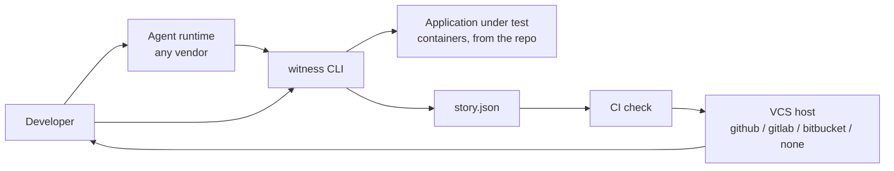
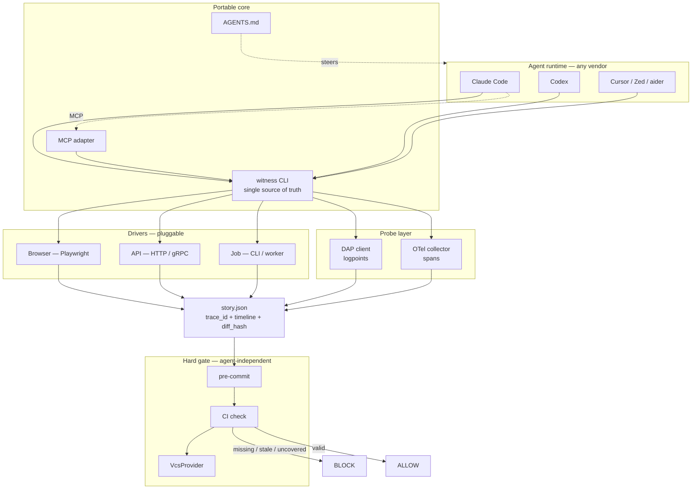
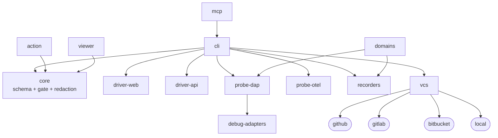
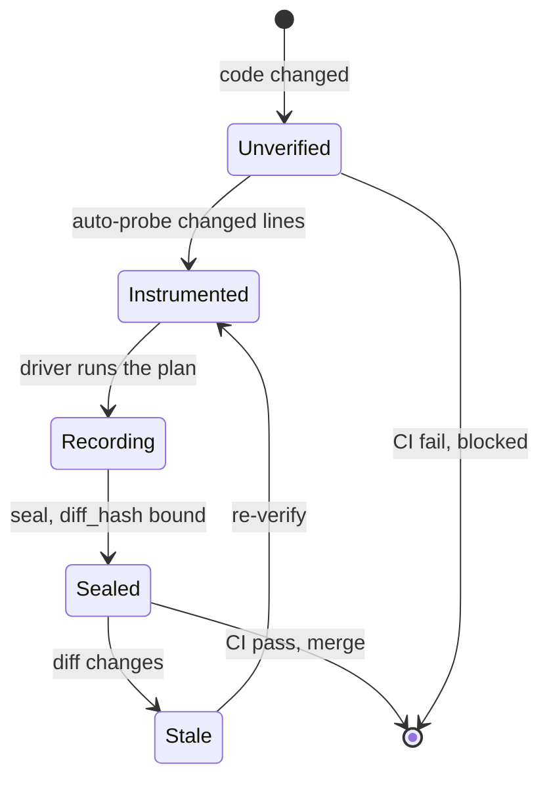
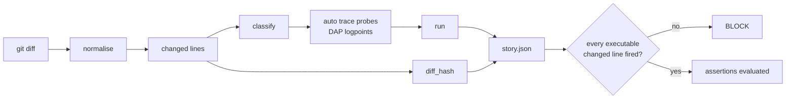
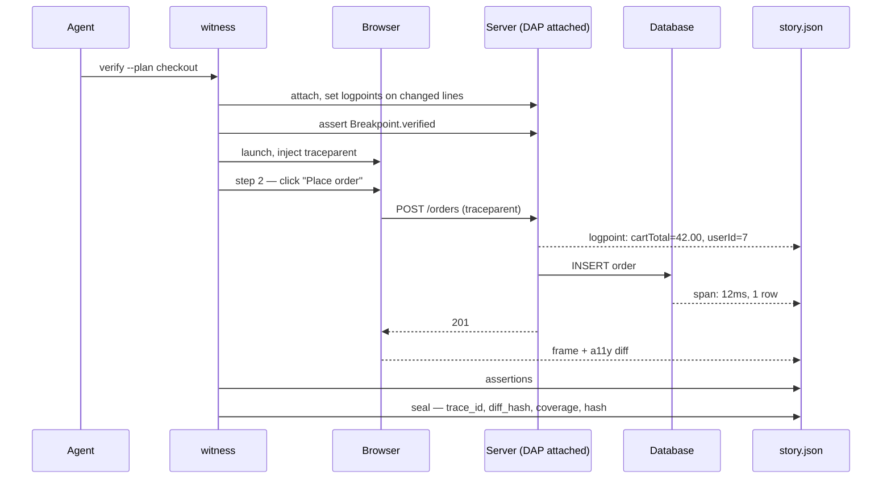
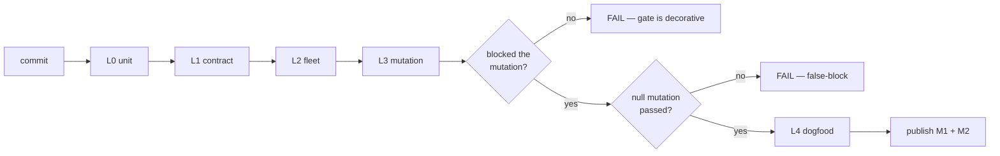
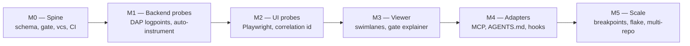

# witness — Technical Design Document

| | |
|---|---|
| **Document type** | TDD — *how*. Requirements and rationale live in the [PRD](./witness-PRD.md). |
| **Status** | Draft |
| **Author** | @burrows99 |
| **Reviewers** | *(unassigned)* |
| **Created** | 2026-08-24 |
| **Last updated** | 2026-08-24 |
| **Version** | 0.1 |
| **Related** | [PRD](./witness-PRD.md) · [Contracts appendix](./witness-contracts.md) — full schemas, interfaces, error codes |

> **How to read this.** §2–§5 give the shape in about five minutes. §6–§8 are the design proper. §9–§14 are the parts reviewers usually ask for and authors usually omit: storage, security, failure modes, alternatives, tests, operations. Formal schemas are deliberately *not* inline — they are verbose and go stale in prose. They live in the contracts appendix; this doc references them by name and discusses only the parts that carry a trade-off.

---

## 1. Requirements traceability

Every design section below exists to satisfy a numbered requirement from the PRD. If a section maps to nothing, it is scope creep; if a requirement maps to nothing, it is unimplemented.

| Req | Design section | Test tier |
|---|---|---|
| FR-1, FR-2, FR-3 | §7.6 Gate evaluation | L0, L3 |
| FR-4 | §7.2 Plan and story lifecycle | L0, L4 |
| FR-5 | §7.7 Extension seams → `VcsProvider` | L0, L2 |
| FR-6 | §7.6 Bypass resolution | L0 |
| FR-7 | §8.1 CLI contract | L0 |
| FR-8 | §10.4 Failure modes | L1, L2 |
| FR-9, FR-10 | §7.5 Diff-driven instrumentation | L1, L3 |
| FR-11 | §7.3 Probes → verification | L1 |
| FR-12 | §7.5 Line classification | L0, L3 |
| FR-13 | §7.1 Story model, §7.4 correlation | L2 |
| FR-14 | §14 Operations → `doctor` | L1 |
| FR-15 | §7.4 Recorders → `readableBy` | L0 |
| FR-16 | §7.9 Story viewer | — |
| FR-17 | §8.2 MCP surface | L2 |
| FR-18 | §7.3 Breakpoints | L1 |
| NFR-5 | §10.1 Security and privacy | L1 |
| NFR-7, NFR-10 | §6.3 Dependency rules | build check |
| NFR-9 | §10.5 Compatibility | L0 |

---

## 2. Context and scope

The system sits between an agent runtime and a version-control host, and touches neither's internals.

- **Upstream:** any coding agent, or a human, invoking a CLI.
- **Downstream:** a CI check that allows or blocks a merge.
- **Under observation:** the application under test, brought up from the repo in containers.

`witness` does not modify application code, does not run in production, and does not persist anything between runs in its free configuration.

**Constraint shape:** this is a greenfield design with an unusually constrained centre. The protocols are fixed and non-negotiable (DAP, W3C Trace Context, MCP), the enforcement point is fixed (CI), and the primary consumer cannot read images. Most of the design work is composition within those constraints rather than invention.

### 2.1 System context



---

## 3. Goals and non-goals (technical)

**Goals**

- **G-T1** Enforcement is independent of the actor. The gate reads a diff and a JSON file.
- **G-T2** One artefact, all tiers, one correlation id.
- **G-T3** `core` is pure: no I/O, no host, no drivers, no probes.
- **G-T4** Every axis of variation is an interface with a free default that must pass the full suite.
- **G-T5** Non-suspending capture by default.

**Non-goals**

- Not a monitoring system. No long-lived collectors, no production deployment.
- Not a test runner. It executes a plan; it does not discover or schedule tests.
- Not a language-agnostic instrumentation layer. Support is explicitly enumerated.

---

## 4. The central design decision

Everything else follows from this, so it goes first.

**Enforcement cannot live in the agent.**

| Layer | Portable | Actually enforces |
|---|---|---|
| `AGENTS.md` | yes — vendor-neutral | no, advisory |
| MCP `InitializeResult.instructions` | yes — every MCP client | no, advisory |
| Stateful MCP tool gating | yes | partial — only if the agent enters |
| **CI + pre-commit** | **yes — universal** | **yes** |
| Vendor hooks | no — per-vendor | yes, but fast-feedback only |

One row is both portable and enforcing. Hooks remain in the design as a latency optimisation; they are never the gate.

**Corollary — gate the diff, not the actor.** Agents are plural, swappable and uncontrollable. The repository is singular and controllable.

---

## 5. Design overview



Four moving parts, in the order they run:

1. **Plan** — committed, reviewable, declares intent and scope.
2. **Instrumentation** — the diff decides where probes go; no human or agent decision.
3. **Run** — a driver acts, probes observe, recorders capture. One story comes out.
4. **Gate** — a pure function turns story + diff into a verdict.

The **driver** is pluggable; the **story** is universal. A backend-only change uses the API driver, never opens a browser, and produces the same artefact for the same gate.

---

## 6. Component design

### 6.1 Package layout

One pnpm workspace. Each package is independently useful and independently forkable.

```
witness/
├─ AGENTS.md
├─ packages/                  Apache-2.0
│  ├─ core/                   story schema, diff_hash, coverage, gate, redaction
│  ├─ cli/                    the binary — the only package that composes everything
│  ├─ probe-dap/              DAP session, logpoint interpolation, output buffer
│  ├─ debug-adapters/         per-language adapters + vendoring
│  ├─ probe-otel/             span collection + traceparent propagation
│  ├─ driver-web/             Playwright driver
│  ├─ driver-api/             HTTP / gRPC driver
│  ├─ recorders/              interface + browser / api / database / terminal
│  ├─ vcs/                    interface + github / gitlab / bitbucket / local
│  ├─ mcp/                    MCP adapter over the CLI
│  └─ viewer/                 story viewer (deferred, §7.9)
├─ domains/                   domain packs
├─ cloud/                     control plane — FSL-1.1-ALv2
├─ action/                    GitHub Action
└─ vendor-hooks/              generated per-vendor shims
```

### 6.2 Dependency graph



### 6.3 Dependency rules — enforced at build time

| Rule | Why | Enforcement |
|---|---|---|
| `core` must not import drivers or probes | the gate must run in CI with no browser and no debugger installed (NFR-7) | import check |
| `core` must not import `vcs` | `core` receives a resolved `Bypass` and returns a `GateResult`; it does not know what a pull request is | import check |
| `packages/*` must not import `cloud/*` | if the CLI needs the control plane, the open core is a demo (NFR-10) | import check |
| `redaction` must live in `core` | redaction must run before disk, not before upload (NFR-5) | code review + L1 test |

These four checks are the architecture. Everything else is convention.

### 6.4 Build, fork or depend

| Component | Verdict | Source | Delta |
|---|---|---|---|
| DAP adapters + vendoring | **FORK** | `debugmcp/mcp-debugger` (MIT) | strip `/src` MCP layer; keep adapters, logpoint interpolation, output buffering, redaction, and the vendoring scripts with SHA-256 verification |
| Story viewer | **DEFER** | Playwright trace viewer (Apache-2.0) | ship nothing at first; fork only when server/DB swimlanes are needed |
| Browser driver | **DEPEND** | `playwright` | public API is enough |
| Spans | **DEPEND** | OpenTelemetry JS SDK | — |
| MCP adapter | **DEPEND** | `@modelcontextprotocol/sdk` | thin wrapper over the CLI |
| Story schema, `diff_hash`, coverage, gate | **BUILD** | — | small, and it *is* the product |
| CLI, API driver, VCS providers | **BUILD** | — | a few hundred lines each |
| Vendor hooks | **GENERATE** | — | one template per vendor from one source |

**The saving from `mcp-debugger` is not the DAP client.** That part is easy. The win is the *vendoring*: downloading and pinning debugpy, CodeLLDB, netcoredbg, Delve and js-debug per platform with checksum verification is weeks of tedious, high-breakage work that is already done and tested.

**Explicitly not forked: `microsoft/DebugMCP`.** Its `add_logpoint` tool confirms the direction, but it is a VS Code extension. It cannot run in CI, and it is the exact IDE lock-in this project exists to remove.

**Fork hygiene:** fork at a tagged release and record the upstream SHA in `FORK.md`; keep upstream as a remote and rebase on a schedule; do the strip in one commit so later rebases stay legible; never reformat; push fixes upstream; if the delta exceeds ~30%, stop rebasing and own it.

---

## 7. Detailed design

### 7.1 The story

A single causally ordered timeline across browser, server and data tiers, threaded by one `trace_id`. The agent declares **intent**, not a collection plan; the harness places probes, runs the flow, and assembles the result.

The full schema is in the [contracts appendix](./witness-contracts.md#3-story1). The parts that carry a trade-off:

**Ordering.** "Causally ordered" needs a rule, because containers skew clocks by more than a whole request:

> Order is derived from (1) `trace_id` / `parent_span_id` causality, then (2) per-process monotonic time, then (3) harness-assigned sequence as tiebreak. Wall-clock timestamps are rendered but never sorted on. An event with no trace context attaches to the enclosing step.

Without this stated, two viewer implementations draw different stories from the same file.

**Sealing.** The story is hashed over its canonical form at seal time and the hash is stored inside it. This is what makes a story checkable by a party that did not produce it — which is the entire value proposition of the paid vault, and costs nothing to add now.

**Single event array, not per-tier arrays.** Per-tier arrays would force every consumer to re-merge, and every consumer would do it differently. One array with a tier discriminant makes the merge the producer's job, once.

### 7.2 Plan and story

A story is produced by executing a **plan**.

| Artefact | Binds to | Where | Why |
|---|---|---|---|
| `plan.json` — steps + assertions | a **scope** (path globs) | **committed** | small, reviewable in a PR, merges cleanly |
| `story.json` — what happened | `diff_hash` + `plan_sha256` | **CI artifact** | large, per-run, conflicts if committed |

**The plan must not bind to `diff_hash`.** An earlier draft had it doing so, which cannot work: the plan is authored before the final diff exists, and every subsequent commit would invalidate every committed plan. Scope binding gives the same guarantee — that evidence matches the change — while surviving a rebase.

The agent commits what it intends to prove; CI produces what actually happened. A reviewer can push back on the plan before looking at whether it went green, which makes the agent's obligation visible rather than implicit.



### 7.3 Probes

Three kinds, one timeline. None stop execution by default.

| Probe | Mechanism | Captures | Tier |
|---|---|---|---|
| UI | Playwright | action, before/after frame, a11y snapshot, console | browser |
| Trace | **DAP logpoint** (`logMessage`) | variable state at a line, without pausing | server |
| Boundary | OpenTelemetry span | HTTP, DB query, queue, cache, timing | cross-tier |
| *Breakpoint* | DAP `SourceBreakpoint` | full stack + scopes, **suspends** | escape hatch only |

**DAP logpoints are the load-bearing choice.** The spec is explicit that when `logMessage` is set the adapter must log rather than break. That is exactly "observe state mutating over the lifetime of the app" without human-style stepping — and it is why breakpoints could never have been the default: you cannot suspend a server mid-request and still observe the request.

**Probe verification is a separate concern from probe firing.** DAP returns `Breakpoint.verified`; an unverified probe is accepted and then silently never fires, which looks identical to "the code never ran" — the exact signal the coverage gate depends on. These get distinct findings (`SV010` vs `SV011`) and distinct remedies. Every adapter contract test asserts `verified === true`, not merely that the request returned OK.

**Adapter line slide.** Adapters routinely move a breakpoint to the next executable statement. Record both the requested and bound line, and treat a slide as covering the span between them; otherwise the requested line reports unfired forever.

**Breakpoints** stay in the design as the exception: disallowed in CI (`SV040`), time-bounded locally so a suspended process cannot hang a run (NFR-11).

### 7.4 Drivers and recorders

A driver *acts*; a probe *observes inside*; a **recorder captures evidence**. Recorders are the layer that grows.

| Recorder | Built on | Agent-readable | Human-readable |
|---|---|---|---|
| `browser` | Playwright | a11y snapshot, screenshot | video, trace |
| `api` | HTTP / gRPC | request + response transcript | rendered timeline |
| `database` | SQL | query log, before/after rows | diff table |
| `terminal` | VHS | `.txt` ASCII output | `.gif` / `.mp4` |

**`readableBy` is the rule that keeps this honest.** A recorder can emit a beautiful video the agent cannot watch. Every artefact declares its readers, and the gate requires at least one agent-readable artefact per step (FR-15). A recorder producing only human-readable output cannot satisfy the gate alone. That is a design constraint, not a bug — it falls directly out of U1 being the primary user.

Adding a layer means implementing `Recorder` and registering it. `core` never changes. Interface definitions: [contracts §7](./witness-contracts.md#7-package-interfaces).

### 7.5 Diff-driven instrumentation

The feature that removes the collection burden:



**Line classification is where the false-block target is won or lost.** "Every changed line has a fired probe" is effectively 100% line coverage on the diff, and will fire on catch blocks, guard clauses, log lines and flag-off paths. NFR-2 (≤2%) is unreachable without classes:

| Class | Determined by | Gate treatment |
|---|---|---|
| `excluded` | normalisation — whitespace, comments, bare brackets, imports, type-only declarations | not counted |
| `executable` | has a verified probe | must fire |
| `defensive` | inside a catch / guard / throw-on-invalid | policy: `off` \| `warn` \| `require` (default `warn`) |
| `waived` | dated waiver with a reason, in the plan | counted, reported, not blocking; capped as % of diff |
| `unbound` | probe accepted, `verified === false` | always blocks — `SV011` |

`defensive` detection needs a small per-language AST or query pattern, which is a real cost not previously budgeted (open question Q1). If it slips, ship `warn` for everyone and revisit once M1/M2 numbers exist.

**Coverage granularity: changed lines on a normalised diff.** File-level is too coarse to be useful; function-level needs an AST per language, which is the cost we are trying to avoid at this stage.

### 7.6 Gate evaluation

A pure function. No I/O, no git shell-out, no host. That is what makes rule "`core` never imports `vcs`" enforceable rather than aspirational, and what lets the same logic run in CI, in pre-commit, and in the L3 harness with no environment.

```
evaluate(story, diff, plans, policy, bypass) -> { verdict, findings[], metrics }
```

Conditions, in order — short-circuiting, because a stale story makes coverage meaningless:

1. Story exists and validates against the schema. → `SV001`, `SV002`
2. `diff_hash` matches the PR's diff. → `SV003`
3. Story executed the plan that is in the tree. → `SV004`
4. Every changed file is in some plan's scope. → `SV012`
5. Every executable changed line has a fired, verified probe. → `SV010`, `SV011`, `SV013`
6. All assertions pass. → `SV020`

Full finding taxonomy: [contracts §5](./witness-contracts.md#5-gate-contract).

**Findings carry a `remedy`, not only a message.** "Line 41 never executed" hands the developer a research task. "Add a step reaching `applyTiered` with `tier >= 2`, or waive with a reason" is actionable. Bypass rate (M3) will track this field more than any other.

**Bypass** is resolved outside `core` by the `VcsProvider` and passed in as data. It requires a reason, produces `SV090` and exit 5 — amber, never green — and is published to the change so it is visible to a reviewer rather than silent.

### 7.7 Extension seams

Every axis of variation has the same shape: an interface in `core`, implementations behind it, and a free default the full test suite must pass under.

| Seam | Free default | Others |
|---|---|---|
| `VcsProvider` | `local` | github, gitlab, bitbucket |
| `Recorder` | `browser` | api, database, terminal |
| `Driver` | `web` | api, job |
| `Runner` | `local` | cloud (paid) |
| `ArtifactStore` | `fs`, `ci` | vault (paid) |
| Domain pack | `fullstack` | data-eng, data-science, ml |

**Host independence.** `git` is not GitHub: `diff_hash` shells out to `git diff` and `git merge-base`, a local tool present wherever code is. That is not coupling. Coupling risk exists only where a **host** is touched — reading a bypass signal, publishing a result, learning the change context — so those three operations, and only those, are behind `VcsProvider`.

| Provider | Bypass signal | Publishes via |
|---|---|---|
| `github` | PR label | check annotation + job summary |
| `gitlab` | MR label | commit status + MR note |
| `bitbucket` | PR label | build status + report |
| `local` | `--bypass "<reason>"` | stdout, exit code |

Selected by `--vcs`, else detected from the environment, else `local`. **`local` is the proof:** no host, no token, no network, and the gate must pass its full suite under it. If `local` cannot run the gate, a host has become load-bearing.

**Domains.** A domain pack is a manifest composing existing drivers, probes, recorders and assertions. It adds no concepts to `core`.

| Domain | Drives | Records | Asserts on |
|---|---|---|---|
| `fullstack` *(v1)* | browser, API, jobs | frames, transcripts, SQL, terminal | UI text, status, rows |
| `data-engineering` | pipeline / DAG runs | table diffs, row counts, schema | schema drift, row deltas |
| `data-science` | notebook / script runs | outputs, plots, dataframes | metric bounds |
| `ml-engineering` | training / eval runs | metric deltas, model cards | regression thresholds |

Same spine every time: the diff says what changed → probes and recorders capture what happened → the gate blocks unexercised or unproven change. Only drivers and recorders differ.

### 7.8 Story assembly



One `traceparent` threads browser → server → DB. The agent never correlates by timestamp; the harness does it at capture time. That single design choice is what turns three log files into one readable artefact, and it is the reason the whole system is worth building rather than scripting.

### 7.9 Story viewer *(deferred to M3)*

Evidence nobody reads is theatre. The viewer makes a run auditable in ~30 seconds: swimlanes per tier with the correlation thread drawn across them, click a UI action to jump to the server frame it caused, variable state inline, and a coverage map where gaps are the finding.

**Deferred deliberately.** Playwright's trace viewer already ships as a self-contained static app with a service worker that reads trace zips, usable as-is for the browser tier.

**The trap to avoid:** hand-authoring Playwright's trace format so server events appear in their viewer. That format is internal and unversioned and will break on every Playwright roll. Emit real traces through the public tracing API for the browser tier, and keep server-tier events in `story.json` until the viewer is forked properly.

---

## 8. API design

### 8.1 CLI — the primary interface

Bash is more universal than MCP; every agent can shell out. CI runs the **same binary** as the agent, so there is one gate and no drift. Precedent: Playwright ships a CLI plus a `Bash(...)` skill, not MCP-first.

```
witness init                                    scaffold config
witness plan   --intent <s> --scope <glob>...   emit a plan skeleton
witness run    --plan <path>                    execute, emit story
witness gate   --run <id> | --story <path>      evaluate, publish
witness verify --plan <path>                    run + gate (the agent's one command)
witness show   --run <id> [--open]              render viewer
witness doctor                                  adapters, ports, path mappings
```

| Exit | Meaning | CI reads it as |
|---|---|---|
| 0 | allow | green |
| 2 | block — an error-severity finding | red, developer's problem |
| 3 | usage / config error | red, config problem |
| 4 | **harness failure** — fixture down, adapter crash, port collision | red, *our* problem |
| 5 | bypassed, recorded | amber |

**Exit 4 must be distinct from exit 2** (FR-8). "Your change is unverified" and "our debugger failed to attach" produce identical developer frustration if they share a code, and the second is the failure mode this project will hit constantly in its first six months. It also keeps catch-rate arithmetic honest: a harness crash is not a catch.

Every command accepts `--json` and emits `GateResult` verbatim on stdout. That is the agent's read path; it never parses human output.

### 8.2 MCP surface

A thin wrapper over the CLI, not a parallel implementation. It exposes `plan`, `verify` and `gate` as tools and sets `InitializeResult.instructions` to steer. It has no logic of its own — if MCP and CLI can disagree about a verdict, the design has already failed.

### 8.3 Cloud HTTP API *(paid tier)*

Small on purpose. The CLI must behave identically with it absent.

```
POST /v1/runs                  → presigned upload targets
POST /v1/runs/{id}/seal        → server re-validates schema and recomputes the seal
GET  /v1/runs/{id}             → metadata + findings
GET  /v1/runs/{id}/story       → 302 to signed URL
GET  /v1/repos/{id}/flake      → per-line flake rate over a window
```

Design points worth review:

- **Auth is OIDC workload identity** from the CI provider, exchanged for a short-lived token. No long-lived secrets in CI.
- **Idempotency on a client-generated ULID** `run_id`; a retried CI job is a no-op, not a duplicate.
- **The server re-validates the seal.** A client-computed verdict is a claim. The vault's value is that it independently recomputed it — that is the difference between storage and evidence.
- **Artefacts never proxy through the control plane**; presigned URLs only, so a 4 MB video does not touch the API tier.

Full endpoint definitions: [contracts §10](./witness-contracts.md#10-cloud-api).

---

## 9. Data storage

### 9.1 Free tier: no database

Filesystem plus CI artifact storage is the entire persistence layer, and that is the point — a gate needing a database cannot run on a laptop with no network (NFR-4).

```
.witness/
  config.json                        committed
  plans/*.plan.json                  committed
  runs/<run_id>/                     gitignored
    story.json
    artifacts/{frames,a11y,api,db,video}/…
    logs/harness.log
    viewer.html
```

Artefact paths inside `story.json` are relative to the run directory. Absolute paths break download-and-open, which is the only way a human ever sees this.

### 9.2 Paid tier: object store plus a Postgres index

Stories are 10² KB–10¹ MB and write-once. Shredding events into rows at CI volume would be expensive and pointless. **Object storage holds the story and artefacts; Postgres holds what is queried.**

| Table | Holds | Notes |
|---|---|---|
| `runs` | one row per run: verdict, shas, `diff_hash`, `story_uri`, `story_sha256` | partitioned by month |
| `findings` | code, severity, file, line | indexed by `(run_id, code)` |
| `coverage_lines` | per-line fired / class / hits | the analytics table; hash-partitioned |
| `artifacts` | kind, uri, bytes, sha256, `readable_by`, `expires_at` | drives retention |

Full DDL: [contracts §9](./witness-contracts.md#9-database-design--needed-where-exactly).

Three product capabilities fall out of this shape rather than needing separate systems:

- **Flake detection** is a group-by over `coverage_lines` — a line that fires in some runs and not others. This only works if coverage is indexed per line rather than buried in a blob, which is the reason for the one denormalised table.
- **Differential retention** falls out of `artifacts.readable_by`: human-readable video expires in weeks, agent-readable snapshots persist for months. That is the storage margin lever, made concrete.
- **Idempotent upload** falls out of the client-generated ULID primary key.

### 9.3 Retention

| Class | Default | Rationale |
|---|---|---|
| story.json | 12 months | small, and it is the evidence |
| agent-readable artefacts | 12 months | small, re-readable, cheap |
| human-readable video / traces | 14 days | dominates cost, rarely re-watched after review |

---

## 10. Cross-cutting concerns

### 10.1 Security and privacy

**This is the hardest part of the commercial story, and it is not a storage problem.**

Evidence is not screenshots. A story carries captured variable state from DAP logpoints, database rows, and request and response bodies — precisely where credentials, tokens and personal data live. A hosted vault is therefore a security review, not a bucket.

- **Redaction runs before an artefact is written to disk**, not before upload. A leaked token in a CI artifact has already leaked. This forces redaction into `core` (NFR-5); if it lived in `cloud/`, the free CLI would write secrets to CI artifacts, which is a worse exposure than the vault ever was.
- Policy is key-based plus pattern-based, with an explicit `onUnknownBinary` behaviour.
- The vault needs per-field policy, retention limits, and a credible answer to "what if we redact wrongly". Expect this to gate enterprise adoption more than price does.
- **Threat model note:** a story is an artefact an untrusted PR can influence. The gate must never execute anything from a story, and schema validation happens before any field is read.

### 10.2 Observability of the harness itself

The harness must be debuggable when it is the thing that broke (M5). `logs/harness.log` records adapter handshakes, `verified` responses per probe, port allocations and container lifecycle. `doctor` reads the same paths without running a verification.

### 10.3 Performance budgets

| Budget | Default | Enforced by |
|---|---|---|
| Total run | 10 min | exit 4 on breach |
| Breakpoint suspension (local only) | 30 s | forced resume |
| Artefacts per run | 500 MB | recorder backpressure |
| Probes per run | 500 lines | path filter, then warn |

**No sampling** (NFR-8). Sampling destroys determinism, and a probe that randomly does not fire blocks a valid change and spikes M2. This runs in CI, not production — pay the overhead.

### 10.4 Failure modes

| Failure | Detection | Behaviour |
|---|---|---|
| Fixture never becomes ready | readiness probe timeout | exit 4, logs retained |
| Adapter attach fails | DAP handshake timeout | exit 4, `doctor` hint |
| Probe accepted but unverified | `Breakpoint.verified === false` | exit 2, `SV011` — this one *is* a verdict |
| Container port collision | bind error | exit 4; randomised ports make it rare |
| Story exceeds size budget | recorder backpressure | drop human-readable artefacts first, keep agent-readable |
| Story fails schema validation | ajv | exit 2, `SV002` |
| Language unsupported | `doctor` / config | exit 3 — refuse, never degrade to log-scraping |

The organising principle: **anything that means "we could not observe" is exit 4, except an unverified probe**, which is exit 2 because the developer's path mapping or build configuration is the cause and the developer is the one who can fix it.

### 10.5 Compatibility and versioning

| Rule | |
|---|---|
| `schema` field mandatory | `witness/story@1` |
| Within a major: additive only | new optional fields, event types, finding codes |
| Unknown major → `SV002`, refuse | never best-effort parse |
| Unknown minor field → ignore, warn once | old CLI reading a new story |
| Finding codes append-only | every consumer keys off them |
| `diff_hash` normalisation is versioned | `normalised-v1` |

The last one is easy to miss and expensive: changing normalisation without versioning it makes every open PR's story stale on the day you ship.

---

## 11. Alternatives considered

| Alternative | Trade-off | Rejected because |
|---|---|---|
| **Enforce via agent hooks** | fastest feedback; zero CI latency | vendor-specific. Switching agents removes the gate. Retained as an optional fast-feedback layer, never the enforcement. |
| **Fork an agent harness, enforce in-loop** | total control of the loop | makes us a vendor — the exact lock-in this exists to remove — plus a permanent rebase tax on the fastest-moving surface in the ecosystem. |
| **`microsoft/DebugMCP` as the probe layer** | `add_logpoint` already exists | a VS Code extension. Cannot run in CI; re-introduces IDE lock-in. The tool confirms the direction; the packaging makes it unusable. |
| **Stop-the-world breakpoints as default** | richest capture: full stack and scopes | you cannot suspend a server mid-request and still observe the request. Logpoints are in-spec and non-suspending; breakpoints stay as an escape hatch. |
| **Sampling probes** | lower overhead on large diffs | destroys determinism. A probe that randomly does not fire blocks a valid change. |
| **Log-scraping for languages with no DAP adapter** | broader language support | flaky, and a flaky gate gets bypassed. Narrow trustworthy support beats broad untrustworthy support. |
| **Committing `story.json`** | gate has something in-tree to check | conflicts on every push, bloats history. Resolved by committing a plan instead. |
| **Building the viewer up front** | better first impression | Playwright's trace viewer already ships as a self-contained static app. Defer until server/DB swimlanes are genuinely needed. |
| **File- or function-level coverage** | fewer false blocks | file-level is too coarse to mean anything; function-level needs an AST per language. Line-level on a normalised diff with classification is the compromise. |
| **MIT for the control plane** | maximum permissiveness | permits a cloud provider to resell the hosted product outright. FSL keeps it source-available without that. |

---

## 12. Testing strategy

The risk is not "is the logic correct" but "does this work on real, messy, polyglot code". So the pyramid is inverted — the expensive tiers carry the weight.

| Tier | What | When | Proves |
|---|---|---|---|
| **L0** Unit | schema, `diff_hash`, coverage math, gate logic | every commit, <5s | logic is correct |
| **L1** Adapter contract | one tiny fixture app per language, same assertions | every commit, ~1min | the DAP adapter conforms |
| **L2** Conformance fleet | real OSS apps in containers | every PR, ~10min | it survives real code |
| **L3** Mutation | inject a known bug, assert the gate **blocks** | every PR | the gate actually gates |
| **L4** Dogfood | `witness` gates its own PRs | every PR | we believe our own claim |
| **L5** Soak | nightly against upstream HEAD | nightly | ecosystem drift caught early |

### 12.1 L3 is the tier that matters

A green suite proves the harness **ran**. It does not prove the harness would have **caught** anything. A fixture is therefore not an app but a triple: `(app, mutation, expected verdict)`.

- Apply a known-bad patch to a real app: break a cart total, off-by-one a paginator, swallow an exception, drop an await.
- Run the harness exactly as an agent would; assert the gate **blocks**.
- Run the **null mutation** — comment-only or formatting — and assert it **passes**.

M1 and M2 fall directly out and ship in the README every release. M2 is not optional: a gate that cries wolf is disabled within a week, which makes M1 irrelevant.

### 12.2 The fleet

RealWorld is 100+ implementations of one app, all conforming to identical functionality and UX specs. Write assertions **once**, run them against Node, Django, Spring, Go, Rails and .NET backends. Because the spec is fixed, **any per-language failure is an adapter bug, not a spec difference** — which is the reason cross-language conformance is normally expensive, and RealWorld removes it.

| Fixture | Why it earns a slot |
|---|---|
| RealWorld × 6 backends | one spec, many languages — the conformance grid |
| OWASP Juice Shop | deliberately broken; free supply of real bugs for L3 |
| Spring PetClinic | canonical Java, plus a microservices variant |

Keep the fleet small and boring. Every app added is a maintenance tax paid forever.

### 12.3 Compose or Testcontainers — both, for different jobs

- **`docker compose`** for local dev: a human wants `docker compose up`, a debugger attached, and a shell.
- **Testcontainers** for CI: programmatic lifecycle, **randomised ports**, guaranteed cleanup when a run crashes.

The randomised-port point is not theoretical. A fixed debug port collides the moment two jobs share a runner, and the failure looks like a product bug rather than an infrastructure one — hours of misdirected debugging, and a direct hit to M5.



---

## 13. Delivery plan



**Backend before UI, deliberately.** DAP logpoints are the novel part and the harder risk; Playwright is known-good. Sequencing the risky work first means a failure at M1 is cheap, whereas discovering it at M3 would invalidate three milestones of work.

Exit criteria per milestone are in [PRD §9](./witness-PRD.md#9-release-criteria).

---

## 14. Operations

### 14.1 Runbook — the four failures that will actually happen

| Symptom | Likely cause | Check |
|---|---|---|
| Probe never fires, code definitely ran | **path mapping** — container path ≠ host path | `verified` flag in `harness.log`; `doctor` |
| Attach times out | debug flag missing or bound to loopback | launch flags table below |
| Intermittent failures on shared runners | fixed debug port collision | confirm Testcontainers randomised ports |
| Gate green but nothing was proved | plan has no assertions | `SV021` warning |

### 14.2 Container debug flags — the week-eaters

| Runtime | Launch flag | Gotcha |
|---|---|---|
| Java | `-agentlib:jdwp=transport=dt_socket,server=y,suspend=n,address=*:5005` | since JDK 9 JDWP binds local-only; the `*:` prefix is mandatory |
| Python | `debugpy --listen 0.0.0.0:5678` | `debugpy` must be installed **inside** the image |
| Go | `dlv --headless --listen=:2345 --api-version=2` | needs `--security-opt=seccomp=unconfined` for ptrace |
| Node | `node --inspect=0.0.0.0:9229` | binds loopback by default; container-invisible otherwise |

**Path mapping is failure #1.** DAP sets breakpoints by path. Every adapter needs `pathMappings` / `sourceFileMap`, and every contract test must assert `Breakpoint.verified === true` — not merely that `setBreakpoints` returned OK. "Accepted but unbound" is the silent killer and it looks identical to "the code never ran", which is exactly the signal the coverage gate depends on.

### 14.3 Scope control

- Fire only on diffs touching instrumentable code — path and language filters.
- Explicit, logged escape hatch, recorded in the PR.
- Breakpoints hard-disabled in CI.
- A gate that fires on README typos is disabled within a week.

---

## 15. Decision log

| # | Question | Decision | Reasoning | Date |
|---|---|---|---|---|
| D1 | Where does enforcement live? | CI, not the agent | only layer that is both portable and binding | 2026-08 |
| D2 | Probe overhead — sample? | no sampling | sampling destroys determinism and spikes M2; CI is not production | 2026-08 |
| D3 | Languages with no DAP adapter | refuse to gate | a gate that degrades to log-scraping is flaky, and flaky gates get bypassed | 2026-08 |
| D4 | Story storage | CI artifact, not in-repo | a committed story conflicts on every push and bloats history | 2026-08 |
| D5 | Consequence of D4 — what does the gate check against? | commit a **plan** | small, reviewable, merges cleanly; makes the agent's obligation visible | 2026-08 |
| D6 | Plan binding | **scope**, not `diff_hash` | a plan bound to a hash is invalidated by its own commit | 2026-08 |
| D7 | Coverage granularity | changed lines, normalised diff, with classes | file-level too coarse; function-level needs an AST per language | 2026-08 |
| D8 | OTel collector | harness owns a transient one | requiring the app to already emit spans limits adoption | 2026-08 |
| D9 | Unexercised vs unobserved | distinct findings | identical symptoms, opposite remedies | 2026-08 |
| D10 | Harness failure signalling | exit 4, distinct from exit 2 | our bugs must not read as the developer's | 2026-08 |
| D11 | Licence boundary | package boundary, decided now | retrofitting a split across a monorepo is sometimes impossible once contributors sign on | 2026-08 |

---

## 16. Open questions

Carried from [PRD §13](./witness-PRD.md#13-open-questions); technical framing here.

| # | Question | Blocks |
|---|---|---|
| Q1 | Does `defensive` classification need a per-language AST, or does a query pattern suffice? | M1, NFR-2 |
| Q3 | Is line-level granularity right for Java, where a statement spans lines? | M1 |
| Q6 | Can `traceparent` be injected into every v1 fleet backend without modifying app code? | M2 |
| Q7 | What happens when a diff touches a file with no DAP adapter alongside files that have one — block, partial-gate, or skip? | M1 |

Q7 is unresolved and worth settling before M1: partial gating is the pragmatic answer and the one most likely to be quietly abused.

---

## 17. References

**Protocols and specs** — [Debug Adapter Protocol](https://microsoft.github.io/debug-adapter-protocol/specification) (`setBreakpoints`, `logMessage`, `Breakpoint.verified`) · [Introducing Logpoints](https://code.visualstudio.com/blogs/2018/07/12/introducing-logpoints-and-auto-attach) · [W3C Trace Context](https://www.w3.org/TR/trace-context/) · [Model Context Protocol](https://modelcontextprotocol.io/) · [AGENTS.md](https://agents.md/)

**Tools** — [Playwright](https://playwright.dev/) · [Testcontainers for Node](https://node.testcontainers.org/) · [VHS](https://github.com/charmbracelet/vhs) · [OpenTelemetry JS](https://opentelemetry.io/docs/languages/js/) · [debugpy](https://github.com/microsoft/debugpy) · [mcp-debugger](https://github.com/debugmcp/mcp-debugger)

**Fixtures** — [RealWorld](https://github.com/gothinkster/realworld) and its [backend spec](https://realworld-docs.netlify.app/specifications/backend/introduction/)

**Licensing** — [Functional Source License](https://fsl.software/) · [Apache-2.0](https://www.apache.org/licenses/LICENSE-2.0)